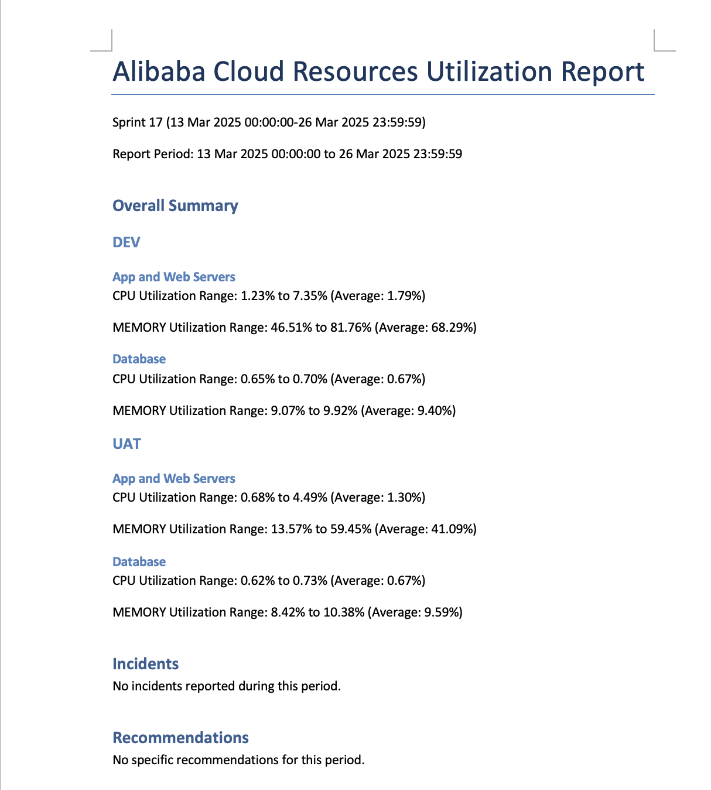
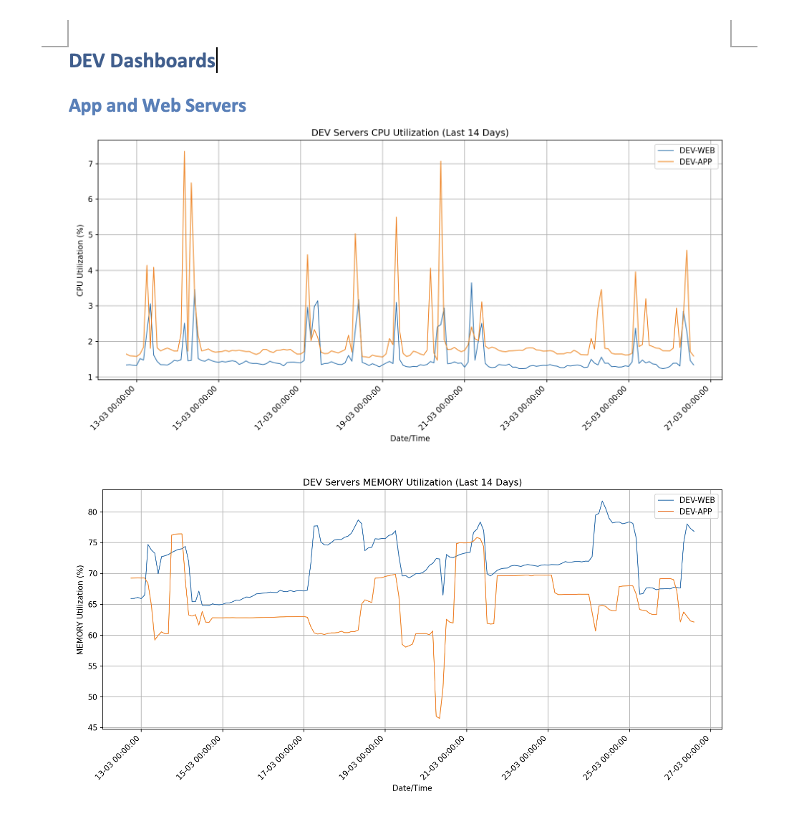

# Alibaba Cloud Performance Metrics Reporter

A Python-based tool that automates the collection, analysis, and visualization of performance metrics from Alibaba Cloud resources. It generates comprehensive reports for ECS instances and RDS databases across different environments with sprint-based tracking capabilities.

This tool streamlines cloud resource monitoring by automatically fetching key performance indicators like CPU and memory utilization from Alibaba Cloud Monitor service. It supports multiple environments (e.g. DEV/UAT/PROD) and generates detailed reports with visualizations for easy performance analysis across sprint cycles. The tool is particularly useful for DevOps teams who need to track resource utilization patterns and make data-driven infrastructure decisions.

This tool can be deployed locally on your machine, or can be deployed on Alibaba Cloud as an automated pipeline, generating scheduled reports and sending reports to your email address.

Example report overview:


Example report graphs:

## Repository Structure
```
.
├── alicloud/                    # Alibaba Cloud specific implementation
│   └── requirements.txt        # Dependencies for cloud environment
└── local/                      # Local development implementation
    ├── app.py                 # Main application logic for metrics collection and reporting
    └── requirements.txt       # Dependencies for local development
```

## Local Usage Instructions
### Prerequisites
- Python 3.x
- Alibaba Cloud account with access to:
  - ECS (Elastic Compute Service)
  - RDS (Relational Database Service)
  - Cloud Monitor Service
- Valid Alibaba Cloud Access Key ID and Secret
- `AccessKey.csv` file in the project root containing credentials
  - Note that access key is required only:
    - if you are running the code locally OR
    - you have separate Alibaba CLoud accounts for the python function and the monitored resources environment.
  
### Installation

1. Clone the repository:
```bash
git clone <repository-url>
cd <repository-name>
```

2. Create and activate a virtual environment:
```bash
# MacOS/Linux
python3 -m venv venv
source venv/bin/activate

# Windows
python -m venv venv
.\venv\Scripts\activate
```

3. Install dependencies:
```bash
# For local development
cd local
pip install -r requirements.txt
```

4. Configure credentials:
Create an `AccessKey.csv` file in the project root with the following format:
```csv
AccessKeyId,AccessKeySecret
your_access_key_id,your_access_key_secret
```

### Quick Start

1. Ensure your `AccessKey.csv` is properly configured
2. Replace the instance id with your Alibaba Clodu resources id
3. Run the application:
```bash
cd local
python app.py
```
4. When prompted, either:
   - Press Enter for automatic sprint calculation
   - Enter a specific sprint number

### More Detailed Examples

1. Collecting metrics for a specific sprint:
```python
# The tool will automatically fetch metrics for:
- DEV environment: 1 web instance, 1 app instance, 1 RDS instance
- UAT environment: 2 web instances, 2 app instances, 1 RDS instance
```

2. Viewing metrics for different instance types:
```python
# Available metrics:
- CPU Utilization (%)
- Memory Usage (%)
```

### Troubleshooting

Common Issues:

1. **Missing Credentials Error**
   - Error: `FileNotFoundError: AccessKey.csv file not found`
   - Solution: Ensure `AccessKey.csv` exists in the project root directory
   - Verify file format matches the required structure

2. **API Access Issues**
   - Error: `InvalidAccessKeyId.NotFound`
   - Check:
     - Credentials in `AccessKey.csv` are correct
     - Access Key has required permissions
     - Region configuration matches your resources

3. **Data Collection Errors**
   - Error: `No data points returned`
   - Solutions:
     - Verify instance IDs are correct
     - Check if instances are running
     - Ensure time range is valid

## Alibaba Cloud deployment
### Domain and DNS
You will need to purchase a domain and setup DNS in order to use Direct Mail
Refer to [Alibaba Cloud Official Guide on Direct Mail](https://www.alibabacloud.com/help/en/direct-mail/user-guide/overview?spm=a2c63.p38356.help-menu-29412.d_4_0.df4f4f7eokhALD) on configuring Direct Mail

### Monitored resources
Have some RDS/ECS ready, they do not require Internet access. Save their instance-id somewhere as you will be using them in the function's environment variable.

### Function Compute
The `alicloud` folder contains the handler python file and `requirements.txt` for dependencies requirements.
Refer to [Alibaba Official Guide](https://www.alibabacloud.com/help/en/functioncompute/fc-2-0/user-guide/deploy-a-code-package-1) on deploying the code package.

Note
- Alibaba Cloud Function Compute included matplotlib as built-in python modules, so you don't have to install it.
- Use Alibaba Cloud Function Compute Public Layer for pandas.
- Config environment variables in your Alibaba Cloud Function Compute configuration page.
- Config the trigger to auto run the function as a cron job

## Data Flow
The tool fetches performance metrics from Alibaba Cloud Monitor service, processes the data to calculate utilization patterns, and generates visual reports. Below is the Alibaba Cloud Architecture diagram for two accounts (one account for generating the report+direct mail config, and another for the environment to be monitored)


Key Component Interactions:
- Authentication using Alibaba Cloud credentials
- API requests to Cloud Monitor service using aliyun-sdk
- Data aggregation for multiple instances and metrics
- Sprint-based time range calculations
- Report generation with charts and statistics
- File output handling for documentation and visualizations